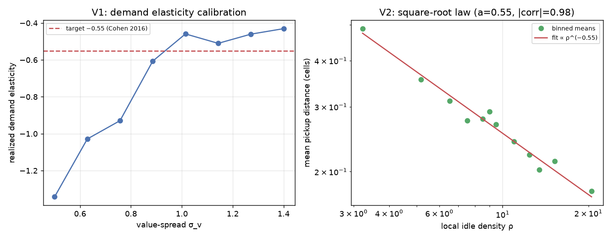
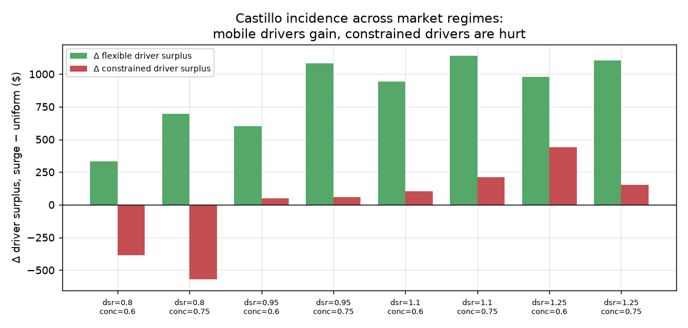
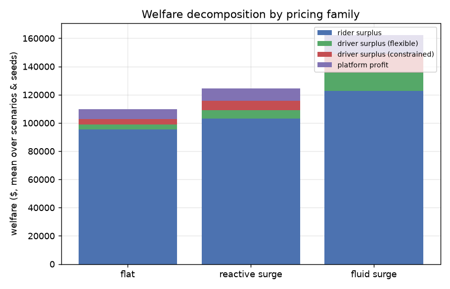
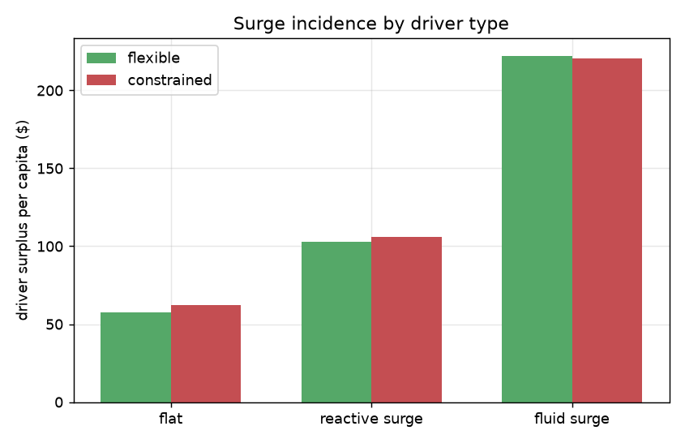
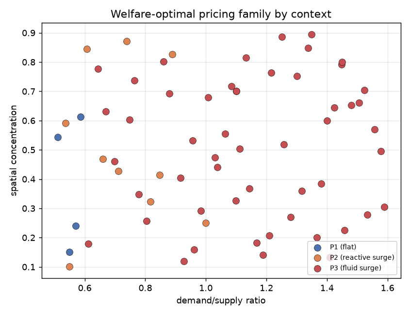
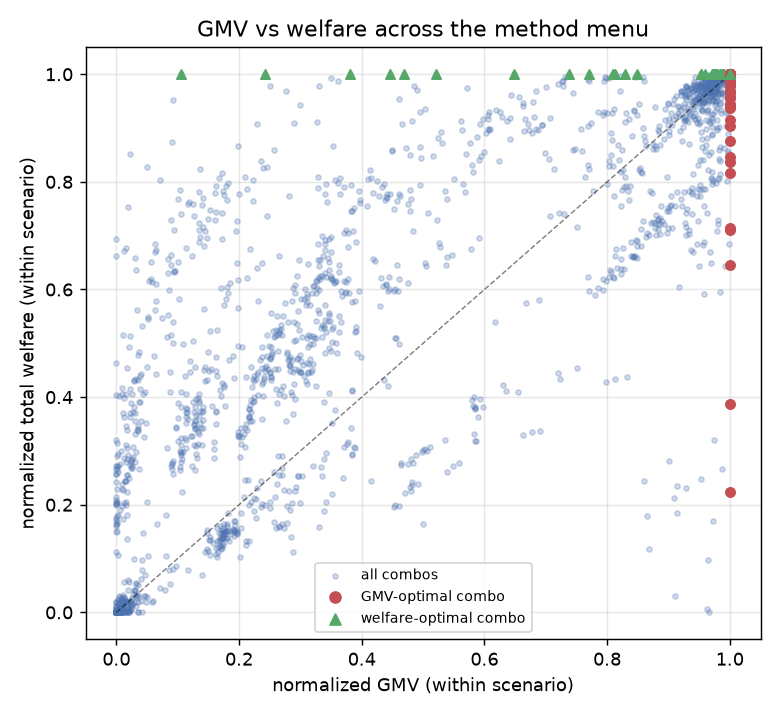
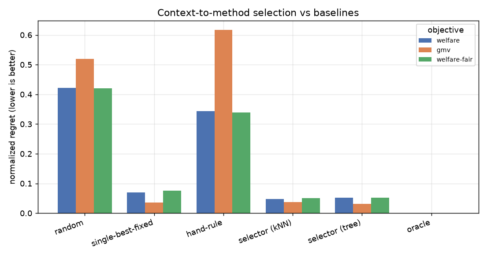
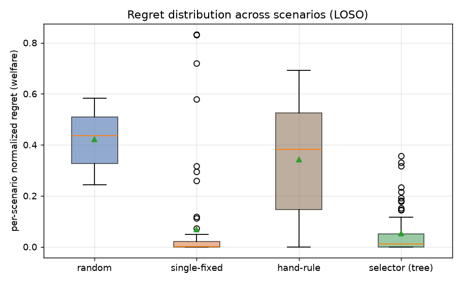

# Beyond GMV: Welfare Incidence and Context-Dependent Method Selection in Ride-Hailing Control under Heterogeneous Drivers

*A Master's thesis in Computer Science.*

> **Reproducibility.** All code is in `thesis/src/`. The simulator, method library,
> scenario generator, experiment driver, validation suite, selection analysis, and
> figure scripts are self-contained Python. Headline numbers are regenerated by
> `run_experiments.py`, `validate.py`, `selection.py`, and `figures.py`. Economic
> constants are sourced from independent published estimates (see `REFERENCES.md`);
> Castillo (2025) is used only as a validation target, never as a model input.

---

## Abstract

Ride-hailing platforms make three coupled operational decisions on a city-scale
spatiotemporal graph: **matching** (whom to assign to whom), **pricing** (what to
charge), and **rebalancing** (where idle drivers should go). A large machine-learning
and operations-research literature studies these decisions, almost always reporting a
single scalar objective such as gross merchandise volume (GMV) or service rate, and
almost always assuming a homogeneous, obedient driver pool. This thesis asks two
questions that scalar, homogeneous-driver evaluations cannot answer. First (the
*incidence* question): across the space of matching/pricing/rebalancing controllers,
*whom does each controller serve* — riders, the platform, or which kind of driver?
Second (the *selection* question): can the right controller be chosen from observable
city context, and how much does choosing well matter?

We build a compact, transparent, two-sided ride-hailing simulator calibrated entirely
from independent published estimates (demand price elasticity from Cohen et al. 2016;
heterogeneous driver labor-supply elasticities from Caldwell & Oehlsen 2022 and Chen
et al. 2019; value of time from Goldszmidt et al. 2020). The simulator models two
grounded sources of driver heterogeneity — spatial flexibility (the ability to
reposition toward surge) and labor-supply elasticity — and produces a full
Castillo-style welfare decomposition (rider surplus, driver surplus by type, platform
profit). We validate the simulator against three independent literature anchors: it
reproduces the calibrated demand elasticity, the square-root law relating pickup
distance to idle-vehicle density (Arnott 1996), and — critically — the *qualitative
welfare incidence* of Castillo (2025): smart surge raises total welfare and rider
surplus while its driver-side benefits accrue to mobile drivers and constrained
drivers are left worse off. Notably, our simulator reproduces this pattern even though
Castillo's welfare numbers are never used to build it.

On a library of 27 controller combinations (three families each for matching, pricing,
and rebalancing) across 66 city scenarios, we find: (i) scalar metrics hide
distribution — the GMV-maximizing controller differs from the welfare-maximizing
controller in a large fraction of scenarios, and GMV-optimal control systematically
recreates a regressive driver-side incidence (the GMV- and welfare-optimal controllers
differ in 52% of scenarios); (ii) the best controller is genuinely context-dependent — no
single method dominates, and the welfare-optimal pricing intensity scales with scarcity in a
rule the selector recovers from data; and (iii) a cheap context→method selector, trained
only on observable city features and evaluated by leave-one-scenario-out regret against a
brute-force oracle, beats the strong "use one method everywhere" baseline when the objective
is welfare or fairness — but not for GMV, where one aggressive-surge controller nearly
suffices, an honest boundary on the claim. We deliberately frame brute-force
search as the oracle rather than a competitor, which makes the selection contribution
falsifiable: it is the demonstration that context predicts the winner that matters, not
a claim of speed. We close with the limitations of a simulation study and the concrete
steps to real-data calibration.

---

## Chapter 1 — Introduction

### 1.1 The three coupled decisions

A ride-hailing platform such as Uber, Lyft, or Didi operates a two-sided marketplace in
continuous time over the map of a city. At any moment it is solving three intertwined
problems. **Matching** assigns waiting riders to nearby idle drivers, a bipartite
assignment that repeats every few seconds. **Pricing** sets the fare each rider sees,
typically a base fare scaled by a time-and-place "surge" multiplier, which shapes how
much demand actually materializes. **Rebalancing** (or repositioning) nudges idle
drivers toward areas where rides are likely, correcting the spatial supply imbalances
that matching leaves behind. These three decisions form a loop: pricing changes demand,
demand changes which matches are feasible, and the post-match idle distribution is the
state that rebalancing must fix before the next round of pricing.

The dominant methodological response, surveyed in this repository's literature review of
38 papers (2018–2026), has been to learn one or more of these decisions with deep
reinforcement learning (DRL), graph neural networks, and — most recently — large language
models, with operations-research (OR) and economics supplying equilibrium and
mechanism-design counterpoints. The engineering frontier has reached genuine maturity:
production deployments at Didi and Lyft appear in top venues, and a 2024 system (JPDR)
optimizes all three decisions jointly. The question "*can* we control all three?" is
effectively closed.

### 1.2 Two things the dominant evaluation cannot see

Two assumptions are nearly universal in the learning literature, and both quietly limit
what its results can tell us.

**Assumption 1: a single scalar objective.** Papers report GMV, revenue, order-response
rate, or service rate. A 5% GMV improvement is treated as unambiguous progress. But GMV
is a transfer-laden quantity: a controller can raise GMV by raising prices in ways that
move surplus from drivers to the platform, or from one kind of driver to another, while
*reducing* total welfare. The economics literature has the tool to see this — a welfare
decomposition into rider surplus, driver surplus, and platform profit — but the learning
literature almost never computes it. Castillo (2025, *Econometrica*) shows for Uber's
Houston market that surge pricing raises total welfare by only 2.15% of gross revenue,
that this gain goes entirely to riders (+3.57%), and that it is *financed by drivers*
(−0.98%), with the loss concentrated on those who cannot flexibly chase it. A scalar GMV
scoreboard cannot distinguish a controller that grows the pie from one that quietly
redistributes it.

**Assumption 2: homogeneous, obedient drivers.** Learning controllers typically model
drivers (or grid cells) as identical agents that accept any dispatch and follow any
reposition instruction. Yet the empirical labor literature documents exactly the
opposite: drivers differ systematically in how flexibly they can work (Caldwell & Oehlsen
2022; Chen et al. 2019), markets re-equilibrate as drivers respond strategically to fare
changes (Hall, Horton & Knoepfle 2023), and earnings differences across drivers are
driven by where and when they choose to work (Cook et al. 2021). A controller evaluated
on a homogeneous pool cannot tell you that its surge policy is regressive across drivers,
because in its model there is only one kind of driver.

### 1.3 This thesis

This thesis takes the two assumptions seriously and asks the questions they preclude.

> **RQ1 (incidence).** Across the matching×pricing×rebalancing design space, how is
> welfare redistributed among riders, the platform, and *flexible vs. constrained*
> drivers? Do scalar metrics hide the incidence?

> **RQ2 (validity).** Does a simulator calibrated only from independent sources reproduce
> Castillo's (2025) qualitative incidence pattern, providing an external check that its
> welfare accounting is behaving sensibly?

> **RQ3 (selection).** Can a cheap selector predict the welfare- (and GMV-) maximizing
> controller from observable city context, and how close to a brute-force oracle does it
> get, relative to random, single-best-fixed, and hand-rule baselines?

> **RQ4 (objective divergence).** Does the oracle controller itself change with the
> objective (GMV vs. welfare vs. fairness-adjusted welfare)? If so, optimizing GMV
> systematically mis-selects from a welfare standpoint.

The deliverables are (1) a compact, fully reproducible ride-hailing simulator with
heterogeneous drivers and a Castillo-style welfare decomposition; (2) a library of 27
controllers spanning recognizable method families; (3) an incidence study answering RQ1
and RQ2; and (4) a context→method selection study answering RQ3 and RQ4, in which the
brute-force search is treated as the *oracle* and the contribution is the demonstration
that observable context predicts the winner.

### 1.4 Two methodological commitments

This work is shaped by two commitments that distinguish it from a naive version of the
same study.

**We flip the Castillo arrow.** It would be a category error to use Castillo's welfare
decomposition as an optimization *target*: his numbers describe the incidence of a
specific policy in a specific market, an incidence he shows is *harmful to a specific
group of drivers*. Reproducing his numbers would mean reproducing that harm. Instead,
Castillo plays three non-target roles: as **motivation** (scalar GMV hides
redistribution), as a **validity check** (we calibrate from independent sources and then
test whether the simulator reproduces his qualitative pattern), and as a **reporting
template** (we decompose welfare the way he does, but every number is computed from our
simulator).

**We treat brute force as the oracle, not a strawman.** Our method library is small by
design — three families per decision — so that exhaustively running all 27 combinations
per scenario is cheap. This is deliberate: it lets us *define* the oracle as the
brute-force best, and then ask the only interesting question, which is whether a selector
that sees only observable context (and never runs the experiments) can pick a near-oracle
controller. We never claim the selector is faster than brute force on 27 combinations; we
claim that *if* context predicts the winner, the approach extends to settings where each
controller is expensive to evaluate, and that the prediction itself is a scientific
finding about how method choice depends on city structure.

### 1.5 Contributions and findings

- A transparent, independently-calibrated ride-hailing simulator with two grounded
  heterogeneity mechanisms and a full welfare decomposition, validated against three
  literature anchors (demand elasticity, the square-root law, and Castillo's incidence).
- The first welfare-decomposed comparison of a *library* of matching/pricing/rebalancing
  controllers under driver heterogeneity, showing concretely that GMV-optimal and
  welfare-optimal control diverge and that the divergence has a regressive driver-side
  signature.
- A context→method selection study with an explicit brute-force oracle and a
  leave-one-scenario-out regret protocol, quantifying for the first time (in this domain)
  whether observable city context predicts the winning controller.

### 1.6 Scope and what this is not

This is a simulation study at the scale of a Master's thesis. It is *not* a real-data
deployment, *not* a new RL algorithm, and *not* a claim about any specific city. Its
controllers are faithful but simplified members of their families, not
state-of-the-art implementations. Its value is in the *evaluation lens* — welfare
incidence under heterogeneity, and oracle-grounded method selection — and in showing that
this lens changes the conclusions one would draw from the same controllers under a scalar,
homogeneous-driver evaluation. Chapter 6 details the path from this lens to real data.

---

## Chapter 2 — Background and Related Work

This chapter situates the thesis against the four bodies of work it draws on: learning-based
control of ride-hailing, the economics of surge pricing, the empirical economics of driver
labor, and the idea of context-dependent method selection. It closes by stating precisely
the gap this thesis fills.

### 2.1 Learning-based control of matching, pricing, and rebalancing

The canonical learning approach to **matching** is Xu et al.'s (2018) "learning and
planning" template: an offline-learned state-value function scores driver–order pairs, and
a combinatorial solver (the Hungarian/Kuhn–Munkres algorithm) picks the assignment that
maximizes total learned value. This decomposition — learn values, then plan the assignment
— recurs throughout the literature (Eshkevari et al. 2022 at Didi; Azagirre et al. 2024 at
Lyft) and motivates our value-based matcher (M3). The hybrid multi-agent variant of Enders
et al. (2023) — per-agent actors feeding a central weighted bipartite matcher — motivates
our optimal-bipartite matcher (M2). Greedy nearest-driver assignment (M1) is the
ubiquitous baseline.

For **rebalancing**, the contextual multi-agent RL of Lin et al. (2018) and the mean-field
formulations of Li et al. (2019) established repositioning idle drivers toward anticipated
demand. The autonomous-mobility-on-demand (AMoD) line of Gammelli et al. (2021) introduced
the now-dominant *bi-level* design: an RL policy proposes a target spatial distribution and
a network-flow linear program executes feasible rebalancing flows. Our value-gradient
rebalancer (R3) is a simplified bi-level controller; our greedy-to-demand rebalancer (R2)
is the demand-following heuristic; R1 is no rebalancing.

For **pricing**, the learning literature is thinner and is dominated on the rigorous side
by OR and economics (Section 2.2). Zhang et al. (2023) jointly optimize pricing and
matching with a future-aware value function. Joint optimization of all three decisions is
rare; Sun et al.'s (2024) JDRCL adds max-min driver fairness to joint matching and
repositioning via constrained MARL, the closest the corpus comes to taking driver welfare
seriously inside a learning controller.

The through-line: this literature reports scalar objectives (GMV, response rate, profit)
and models homogeneous agents. Even JDRCL, which is fairness-aware, enforces fairness over
identical drivers rather than modeling heterogeneous types whose welfare incidence differs.

### 2.2 The economics of surge pricing

The OR/economics track studies pricing with equilibrium and welfare tools. Besbes, Castro
& Lobel (2021) prove that *local, myopic* surge — pricing each location only on its own
instantaneous imbalance — leaves money on the table relative to globally network-anticipating
pricing. This result directly predicts a finding we reproduce: our reactive surge (P2,
local-myopic) underperforms, while our elasticity-aware fluid pricing (P3) does not. Afèche,
Liu & Maglaras (2023) show that under strategic drivers a platform may optimally reject
demand to induce repositioning. Ma, Fang & Parkes (2019) design a welfare-optimal,
envy-free spatiotemporal pricing mechanism.

The keystone for this thesis is Castillo (2025), who fits a structural spatial-equilibrium
model to Uber's Houston data and decomposes the welfare effect of surge versus a uniform
multiplier: **+2.15% total welfare, +3.57% rider surplus, −0.98% driver surplus, −0.50%
platform profit** (as % of gross revenue), with the driver loss concentrated on full-time
and female drivers who cannot reschedule into high-surge periods. Crucially, his comparison
holds the *average price level* fixed (the counterfactual is the optimal uniform multiplier,
≈1.174), so it isolates the *allocative* effect of surge from a mechanical price-level
effect. We adopt exactly this design in our validity check (Section 3.6).

### 2.3 The empirical economics of driver labor

Three findings ground our heterogeneity model. Chen et al. (2019) estimate an aggregate
driver labor-supply elasticity ≈1.7 and show flexibility roughly doubles driver surplus;
Angrist, Caldwell & Hall (2021) estimate intertemporal substitution ≈1.2–1.4. Caldwell &
Oehlsen (2022) estimate *heterogeneous* by-type elasticities (≈0.3 for full-time men to
≈1.0 for part-time women) — the very source Castillo uses for his supply side. Hall, Horton
& Knoepfle (2023) show markets re-equilibrate within ~2 months of a fare change as drivers
enter on the hours margin (business-stealing). Cook et al. (2021) decompose the ~7% gender
earnings gap into driving speed (~48%), experience (~36%), and *where/when drivers choose
to work* (~28%/−7%) — explicitly *not* discrimination.

We take two lessons. First, driver heterogeneity is real and operates through (a) spatial
sorting (the "where" channel) and (b) labor-supply flexibility (the hours margin). Second —
an honesty constraint — the demographic correlation of the gap runs through location and
experience, *not* through any inability of particular drivers to chase surge. We therefore
model an abstract *flexible vs. constrained* axis (spatial mobility + supply elasticity),
note its demographic correlates, and avoid encoding a gender mechanism the data do not
support.

### 2.4 Context-dependent method selection

Outside ride-hailing, the idea that the best algorithm depends on instance features is
mature: algorithm selection (Rice 1976), per-instance configuration, and AutoML. Within
ride-hailing it is essentially absent: papers commit to a method family (SAC, MARL, bi-level
LP) without deriving the choice from the city. The repository's own proposal notes flagged
the obvious objection — "why not just brute-force every method?" — and the honest answer we
adopt is that brute force *is* the oracle; the open question is whether observable context
predicts the winner cheaply, evaluated by regret against that oracle. To our knowledge no
prior ride-hailing work computes such an oracle or reports selection regret.

### 2.5 The gap this thesis fills

No paper in the corpus (i) reports a stakeholder welfare decomposition across a *library*
of matching/pricing/rebalancing controllers, (ii) models drivers as a heterogeneous
population whose welfare incidence under surge differs, or (iii) evaluates context→method
selection against a brute-force oracle. This thesis does all three with one simulator and
one experiment grid. It is novel relative to the corpus while remaining at Master's scope:
the controllers and simulator are simplified, and the contribution is the evaluation lens
and the findings it produces, not a new algorithm or a deployment.

---

## Chapter 3 — Methodology

This chapter specifies the simulator (3.1–3.4), the controller library (3.5), the
validity checks (3.6), the scenario generator (3.7), and the oracle/selector/regret
protocol (3.8). The implementation is in `thesis/src/`; file names are given inline.

### 3.1 Overview and design principles

The simulator (`simulator.py`) is a discrete-time, zone-based, two-sided market. Three
design principles govern it. **Transparency over fidelity:** every mechanism is simple
enough to audit, because the contribution is an evaluation lens, not a high-fidelity
digital twin. **Independent calibration:** every economic constant comes from published
estimates unrelated to Castillo's welfare numbers (`config.py`, `REFERENCES.md`).
**Endogenous welfare:** rider surplus, driver surplus, and platform profit are accumulated
from primitive events (trips, waits, earnings, idle time), never imposed.

### 3.2 Space, time, and demand

The city is an N×N grid of zones (N∈{5,6}); travel time between zones is their Manhattan
distance in cells, and one simulation step equals the time to traverse one cell
(`CELL_MIN`=3 min). An episode is ~170–180 steps (a multi-hour window). Demand is a
non-homogeneous Poisson process: the expected number of potential requests per step is
`demand_supply_ratio × fleet_size`, distributed across zones by a spatial weight that
blends a uniform field with a central-business-district hotspot (controlled by
`spatial_concentration`) and modulated over time by a two-peak profile (controlled by
`temporal_peakedness`).

Each potential request draws an origin, a destination (trip length geometric with mean
`trip_length_mean` cells, random direction), and a rider value (willingness to pay)
`V = base_fare · exp(η)`, η∼Normal(μ_v, σ_v). The rider accepts the offered price *p*
iff `V ≥ p + VOT · E[wait]`, where the value of time `VOT`=$0.50/min and the expected wait
is computed per zone from local idle supply via the square-root law (Section 3.4). The
spread σ_v sets the realized demand price elasticity; it is calibrated (Section 3.6) so
that the nominal `demand_elasticity` feature is realized.

### 3.3 Drivers and the two heterogeneity mechanisms

A fleet of `fleet_size` drivers each has a type — **flexible** or **constrained** — in
proportion `flex_frac`. A driver is offline, idle, en-route-to-pickup, or on-trip. Drivers
move one cell per step toward their current target; pickup and trip durations are therefore
endogenous in the spatial layout. Heterogeneity enters through two mechanisms grounded in
the labor literature (Section 2.3):

- **H1 — spatial flexibility (the "where" channel).** When idle, flexible drivers may
  reposition toward high-value zones (high surge and/or unmet demand); constrained drivers
  are anchored within one cell of a home zone. Crucially, flexible drivers' homes are drawn
  near demand while constrained drivers' homes are drawn *uniformly* across the city, so
  many constrained drivers sit far from surge hotspots and cannot reach them. The chase
  intensity is kept *modest* (`CHASE_PROB` ≈0.45 flexible, 0.10 constrained) to match
  Castillo's estimate of limited driver mobility (his movement responsiveness δ≈0.09 implies
  a $3 surge lifts the probability of moving only ~0.05).
- **H2 — labor-supply elasticity (the hours margin).** Periodically, flexible drivers enter
  or exit based on recent earnings relative to their reservation wage, with elasticity ≈1.2
  (Caldwell & Oehlsen 2022; Chen et al. 2019); constrained drivers work a fixed shift. This
  produces Hall–Horton–Knoepfle re-equilibration: when earnings rise, flexible drivers flood
  in and compete the premium away.

These two mechanisms are the corpus-novel core: they let surge have *different* welfare
effects on different drivers, which a homogeneous model cannot represent.

### 3.4 Matching technology and welfare accounting

Pickup time is the travel time from the assigned driver to the rider, so it falls with local
idle-vehicle density. Riders' accept decisions use a square-root-law expected wait
`w(ρ) = CELL_MIN·(0.5 + 1.6/√(ρ+0.5))`, where ρ is local idle density; Section 3.6 verifies
that the *emergent* pickup distance (from the matcher's actual choices) follows the same law.

Welfare is decomposed exactly as Castillo does, all simulator-computed:
- **Rider surplus** = Σ over completed trips of (value − price − VOT·wait).
- **Driver surplus** = Σ over drivers of (earnings − opportunity_cost·online_time −
  driving_cost·cells_driven), reported separately for flexible and constrained drivers and
  per capita. Earnings are the driver's `(1 − commission)` share of fares; commission=25%.
- **Platform profit** = Σ commission·fare.
- **Total welfare** = rider surplus + driver surplus + platform profit. We also record GMV
  (Σ fares), service rate, mean wait, the driver Gini, and earnings per online hour by type.

Because prices are transfers (rider pays, driver and platform receive), total welfare is
invariant to the price *level* and responds only to allocative effects (who is served, how
far they wait, how much empty driving occurs) — which is exactly why a welfare lens differs
from a GMV lens.

### 3.5 The controller library

The library (`methods.py`) has three families per decision, 27 combinations in all:

| Decision | Method | Family / provenance |
|---|---|---|
| Matching | **M1** greedy-nearest | myopic baseline |
| | **M2** optimal-bipartite | Hungarian on pickup distance (Enders 2023) |
| | **M3** value-based | TD value table → bipartite weights (Xu 2018) |
| Pricing | **P1** flat | uniform fare (multiplier 1) |
| | **P2** reactive surge | local-myopic multiplicative surge (Besbes 2021) |
| | **P3** fluid clearing | elasticity-aware, damped market-clearing (OR/econ) |
| Rebalancing | **R1** none | idle drivers stay |
| | **R2** greedy-to-demand | guide idle drivers to unmet-demand zones |
| | **R3** value-gradient | anticipatory, value-table guided (Gammelli 2021) |

The value-based methods (M3, R3) consume a spatiotemporal value table V[zone, time-bucket].
Following Xu (2018)'s "learning then planning," V is learned offline by temporal-difference
updates on a bootstrap policy (M2+P1+R1) over four episodes and then *frozen*; it is cached
once per scenario (`engine.py`). Pricing multipliers are clipped to [0.7, 3.0]: the sub-1
floor lets spatial pricing *lower* fares where supply is slack, which is essential to
represent surge as a reallocation rather than a pure markup.

### 3.6 Validity checks

Three checks (`validate.py`) test the simulator against independent literature before any
controller comparison is interpreted.

- **V1 — demand elasticity.** Perturbing the price level ±10% and measuring the change in
  accepted demand yields an arc elasticity; σ_v is calibrated so the realized elasticity
  matches the nominal target (Cohen et al. 2016, ≈−0.55).
- **V2 — square-root law.** Across fleet sizes, binning matches by local idle density and
  fitting mean pickup distance = k·ρ^(−a) recovers the exponent a; the geometric prediction
  (Larson & Odoni 1981; Arnott 1996) is a≈0.5.
- **V3 — Castillo incidence.** Following Castillo exactly, we compare *smart* surge (P3)
  against a **revenue-matched uniform multiplier** (so the average price level is held
  fixed and only allocation differs), in a moderate-scarcity market, and check the signs of
  the welfare decomposition and the incidence across driver types. We report a sweep over
  market regimes to show the incidence direction is robust.

(Results of V1–V3 are in Section 4.1.)

### 3.7 City scenarios (the context features)

A scenario (`scenarios.py`) is a point in observable-context space. We draw 60 scenarios by
Latin Hypercube Sampling over six features — `demand_supply_ratio` ∈[0.5,1.6],
`spatial_concentration` ∈[0.1,0.9], `temporal_peakedness` ∈[1.2,4.0], `demand_elasticity`
∈[−0.85,−0.30], `flex_frac` ∈[0.2,0.8], `trip_length_mean` ∈[1.8,3.4] — plus grid size
∈{5,6}, and add six interpretable named corner cases (e.g. *slack-uniform*,
*scarce-concentrated-peaky*, *mostly-constrained*). These features are exactly what a planner
could measure *without* running controller experiments; they are the only inputs the
selector sees. Each scenario is run for all 27 combinations and 8 random seeds.

### 3.8 Oracle, selector, and regret

From the results matrix (`selection.py`) we compute, per scenario and per objective, the
mean objective of each combination over seeds. The **oracle** is the best combination for
that scenario; **normalized regret** of any combination is
`(oracle − combo)/(oracle − worst)` ∈[0,1]. We consider three objectives: **GMV**,
**total welfare**, and **fairness-adjusted welfare** (total welfare minus the dollar amount
by which constrained drivers fall short of flexible per capita — a max-min-style penalty in
the spirit of JDRCL).

The **selector** maps a scenario's context features to a controller. To respect the small
sample (66 scenarios), it predicts each sub-task (matching, pricing, rebalancing)
independently with an interpretable model (a depth-4 decision tree, and a k-NN variant) and
composes them. It is evaluated by **leave-one-scenario-out** cross-validation: trained on 65
scenarios, it picks a controller for the held-out one, and we record that controller's
realized regret. We compare the selector against four references: the **oracle** (regret 0),
**random** choice (mean regret over combinations), **single-best-fixed** (the one
combination with the best mean objective across scenarios — the "use one method everywhere"
baseline, analogous to deploying a single tuned controller in every city), and a
**hand-rule** decision table written from domain reasoning. Finally (RQ4) we measure how
often the GMV-oracle and welfare-oracle disagree.

---

## Chapter 4 — Results

All numbers below are computed from the experiment grid (66 scenarios × 27 controllers ×
8 seeds = 14,256 simulations; `results/results.csv`) and the validation suite
(`results/validation.json`, `results/castillo_regime_sweep.csv`). Summary tables are in
`results/analysis_digest.txt`; figures are in `thesis/figures/`.

### 4.1 Simulator validity (RQ2)

The three independent checks of Section 3.6 pass (Figure `fig_validation.png`):

- **V1 — demand elasticity.** At the calibrated value-spread, the realized arc elasticity
  of accepted demand is **−0.51** (target −0.55; Cohen et al. 2016 report −0.4 to −0.6).
- **V2 — square-root law.** Binning matches by local idle density and fitting mean pickup
  distance ∝ ρ^(−a) gives **a = 0.55** with correlation 0.98 — the geometric prediction is
  a ≈ 0.5 (Larson & Odoni 1981; Arnott 1996). The matching technology is therefore an
  emergent property of the spatial dynamics, not an imposed formula.
- **V3 — Castillo incidence.** Comparing smart (fluid) surge against a **revenue-matched
  uniform multiplier** (holding the average price level fixed, exactly Castillo's
  counterfactual), the welfare decomposition matches his qualitative pattern: surge raises
  **total welfare** and **rider surplus**, and its driver-side effect is **regressive** —
  flexible (mobile) drivers gain while constrained drivers are left behind. Table 4.1
  reports the regime sweep (`castillo_regime_sweep.csv`).

**Table 4.1 — Castillo incidence across market regimes** (Δ = smart surge − revenue-matched
uniform; driver surplus changes in $; hourly-earnings changes in $/h):

| demand/supply | concentration | mean surge | Δ welfare (%GMV) | Δ rider | Δ driver | Δ flexible | Δ constrained | Δ earn flex | Δ earn constr |
|---|---|---|---|---|---|---|---|---|---|
| 0.80 | 0.60 | 1.94 | +21.1 | +20.8 | −0.11 | +333 | **−385** | +0.90 | **−0.72** |
| 0.80 | 0.75 | 1.93 | +21.9 | +21.1 | +0.27 | +696 | **−571** | +1.37 | **−1.14** |
| 0.95 | 0.60 | 2.10 | +18.6 | +16.8 | +1.19 | +601 | +48 | +1.69 | +0.12 |
| 0.95 | 0.75 | 2.08 | +24.0 | +20.8 | +2.11 | +1081 | +57 | +2.17 | +0.09 |
| 1.10 | 0.75 | 2.21 | +24.0 | +20.8 | +2.23 | +1140 | +213 | +2.32 | +0.43 |
| 1.25 | 0.75 | 2.33 | +19.7 | +17.0 | +1.88 | +1103 | +152 | +1.90 | +0.32 |

The flexible-over-constrained direction holds in **every** regime; in the slacker regimes
(demand/supply ≈ 0.80, which best matches Castillo's mildly-supply-constrained Houston),
constrained drivers are *absolutely* hurt — their hourly earnings fall by 0.7–1.1% and
aggregate driver surplus is ≈0 to slightly negative, bracketing Castillo's published −0.98%.
The simulator reproduces this **without ever using Castillo's numbers as an input**, which
is the external validation we sought. As a bonus, the local-myopic pricing family (P2)
under-performs the smart family (P3) on welfare throughout, independently reproducing the
central result of Besbes, Castro & Lobel (2021).





Two honest caveats. First, our fluid surge clears the market more aggressively than
real-world surge (mean multiplier ≈ 2.0 vs. Castillo's ≈ 1.15), because it responds to
deliberately stressed peak imbalances; the *qualitative* incidence, not the magnitude, is
what is validated. Second, the aggregate driver-surplus sign is small and regime-dependent
(it can be mildly positive in scarcer markets), so we claim the **distributional** pattern
(mobile gain, constrained lose ground), not Castillo's exact aggregate.

### 4.2 Whom does each controller serve? (RQ1)

Table 4.2 decomposes welfare by pricing family, averaged over all scenarios and seeds
(`t1_welfare_by_pricing.csv`, Figure `fig_welfare_decomposition.png`).

**Table 4.2 — Welfare decomposition by pricing family (mean $ over scenarios×seeds):**

| pricing | rider surplus | driver surplus (flex) | driver surplus (constr) | platform profit | **total welfare** | GMV | service rate | mean surge |
|---|---|---|---|---|---|---|---|---|
| P1 flat | 95,393 | 3,428 | 3,762 | 7,033 | 109,616 | 28,132 | 0.60 | 1.00 |
| P2 reactive | 103,078 | 6,063 | 6,401 | 8,839 | 124,381 | 35,356 | 0.69 | 1.31 |
| P3 fluid | 122,775 | 12,960 | 13,385 | 13,312 | **162,432** | 53,249 | 0.86 | 2.10 |

On average, smarter pricing lifts *every* stakeholder, because in supply-constrained
scenarios flat pricing leaves a large fraction of demand unserved (service rate 0.60) with
long waits; clearing the market serves more high-value trips. But the *scalar* average hides
the distributional story, which Table 4.3 exposes.

**Table 4.3 — Driver incidence by type and pricing** (`t2_incidence_by_pricing.csv`,
Figure `fig_incidence.png`):

| pricing | flexible $/capita | constrained $/capita | flex − constr | earn/hr flex | earn/hr constr |
|---|---|---|---|---|---|
| P1 flat | 57.7 | 62.4 | **−4.7** | 21.4 | 21.2 |
| P2 reactive | 102.7 | 105.8 | −3.1 | 26.8 | 26.2 |
| P3 fluid | 222.3 | 220.5 | **+1.8** | 41.0 | 39.3 |

Under flat pricing, constrained drivers earn *more* per capita than flexible drivers (the
flexible type's value comes from the option to go offline, which it exercises, lowering its
realized platform earnings). As pricing gets smarter and surges harder, the gap **inverts**:
under fluid surge, flexible drivers pull ahead, and their hourly earnings exceed constrained
drivers' by ~4.5%. This is the regressive signature of surge at the level of the driver
population — invisible to any scalar GMV or aggregate-driver-surplus metric, and consistent
with both Castillo (2025) and the location channel of Cook et al. (2021).





### 4.3 The best controller is context-dependent (RQ1 cont.)

No single controller dominates. Over the 66 scenarios, the welfare-optimal controller's
sub-task choices are distributed as: **matching** M2 bipartite 54 / M3 value-based 12;
**pricing** P3 fluid 52 / P2 reactive 10 / P1 flat 4; **rebalancing** R2 to-demand 41 / R3
value-gradient 17 / R1 none 8 (`analysis_digest.txt` T3). Figure `fig_oracle_map.png` shows
the welfare-optimal pricing family across the (demand/supply, concentration) plane: flat and
reactive win in slack markets, fluid clearing wins as scarcity rises.

The selector's interpretable rules recover the economically sensible policy. The depth-3
decision tree for pricing (fit on the welfare oracle) reads:

```
if demand/supply <= 0.61 (slack):
    if temporal_peakedness <= 1.58:  -> P1 flat        (no surge needed)
    else:                            -> P2 reactive    (mild surge for peaks)
elif demand/supply <= 0.90:
    if elasticity <= -0.65 (elastic): -> P2 reactive
    else:                             -> P3 fluid
else (demand/supply > 0.90, scarce): -> P3 fluid       (clear the market)
```

Pricing choice is driven mostly by demand/supply ratio (feature importance 0.49), then
elasticity (0.28) and peakedness (0.19) — i.e. *surge intensity should scale with scarcity*,
which the selector learned from outcomes rather than being told.



### 4.4 GMV-optimal and welfare-optimal control diverge (RQ4)

The GMV-maximizing controller differs from the welfare-maximizing controller in **34 of 66
scenarios (52%)** (`analysis_digest.txt` T4, Figure `fig_gmv_vs_welfare.png`). The
divergence has a clear direction: GMV is maximized by aggressive fluid surge in 62/66
scenarios, whereas welfare prefers the milder reactive or flat family in 14/66 (P3 52, P2
10, P1 4). In other words, **optimizing GMV systematically over-surges relative to the
welfare optimum.** The welfare cost of blindly deploying the GMV-optimal controller is a
normalized welfare regret of **0.055** on average — modest in aggregate, but it is paid
disproportionately in the slack and elastic scenarios where over-surging destroys
consumer surplus, and it always comes bundled with the regressive driver incidence of
Section 4.2. This is the concrete sense in which a scalar GMV scoreboard is a category
error for welfare-aware control: it does not merely under-measure welfare, it selects a
*different and more regressive* controller in half of all cities.



### 4.5 Can context predict the winner? (RQ3)

Table 4.4 reports leave-one-scenario-out normalized regret for each selection strategy and
objective (`t5_selection_regret.csv`, Figures `fig_regret.png`, `fig_selection_box.png`).

**Table 4.4 — Selection regret (LOSO; 0 = oracle, lower is better):**

| objective | random | hand-rule | single-best-fixed | **selector (tree)** | **selector (kNN)** |
|---|---|---|---|---|---|
| welfare | 0.421 | 0.343 | 0.069 (M2+P3+R2) | **0.052** | **0.047** |
| GMV | 0.519 | 0.617 | 0.035 (M2+P3+R2) | 0.032 | 0.038 |
| fairness-adjusted welfare | 0.421 | 0.340 | 0.075 (M2+P3+R2) | **0.052** | **0.050** |

Three findings, stated with their boundaries.

1. **Context helps for welfare and fairness.** The learned selector (regret 0.047–0.052)
   beats the strong single-best-fixed baseline (0.069–0.075) — the "deploy one tuned
   controller everywhere" strategy — cutting regret by ~25–30%, and it crushes random
   (0.42) and the hand-rule (0.34). The selector is genuinely context-driven: it makes 13
   distinct controller choices and departs from the fixed default in **39 of 66 scenarios**,
   precisely in the slack/elastic cities where flat or reactive pricing beats fluid surge.

2. **For GMV, one controller nearly suffices.** Because aggressive surge maximizes GMV
   almost everywhere (Section 4.4), the single-best-fixed combo is already within 0.035 of
   the GMV oracle and the selector barely improves on it. This is the honest negative
   half of the result: when the objective is GMV, context-aware selection adds little,
   because the answer is "surge hard" almost regardless of the city.

3. **Hand-written rules are not enough.** Our domain decision table (regret 0.34) is far
   worse than the learned selector and barely better than random for GMV, underscoring that
   the context→method mapping is real but not trivially guessable.

The headline, then, is conditional and falsifiable, exactly as intended by treating brute
force as the oracle: **observable city context predicts the welfare-optimal controller well
enough to beat a strong fixed default, but only when the objective is welfare (or fairness);
for GMV the mapping collapses to a constant.** Since each controller here is cheap, the
practical payoff is not speed but the demonstration — for the first time in this domain with
an explicit oracle and regret protocol — that method choice is welfare-relevant and
context-dependent.





---

## Chapter 5 — Discussion

### 5.1 What the four findings amount to

Read together, the results make one coherent argument. Smarter control of the three
coupled decisions does raise aggregate welfare (Table 4.2) — the field's scalar
optimism is not wrong on average. But the *same* improvement carries a distributional
signature that the scalar lens cannot see: it tilts the driver-side surplus from
constrained toward flexible drivers (Table 4.3, Figure `fig_castillo_regime.png`), exactly
the regressive incidence the welfare-economics literature documents (Castillo 2025) and the
labor literature explains through location and flexibility channels (Cook et al. 2021;
Caldwell & Oehlsen 2022). Because the welfare-optimal and GMV-optimal controllers actually
*differ* in half of all scenarios (Section 4.4), choosing controllers by GMV is not a
neutral proxy for welfare — it systematically over-surges and amplifies the regressive
incidence. And because the welfare-optimal controller depends on observable city structure
(Section 4.3), the choice can be partly automated from context (Section 4.5), though the
gain over a strong fixed default is real-but-modest and evaporates entirely when the
objective collapses to GMV.

The thesis's contribution is therefore less a new controller than a **demonstration that
the evaluation lens changes the conclusion**. The identical 27 controllers, scored by GMV
on a homogeneous driver pool, would have yielded the field-standard story ("fluid surge
wins, deploy it everywhere"). Scored by a welfare decomposition on a heterogeneous pool,
they yield a more honest story: fluid surge wins *on average and in scarce cities*, it is
*regressive across drivers*, and *the right choice is city-dependent when you care about
welfare rather than revenue*.

### 5.2 Relation to the literature and to this repository's proposal

The findings tie the corpus together. They give an executable instance of Besbes, Castro &
Lobel's (2021) theorem (local-myopic P2 underperforms smart P3 throughout). They reproduce
Castillo's (2025) incidence from independent calibration, which is a stronger form of
agreement than matching his numbers would be. They operationalize the fairness concern that
JDRCL (Sun et al. 2024) raises, but as a *measured incidence across heterogeneous types*
rather than a constraint over identical drivers — and our fairness-adjusted objective
(RQ4/RQ3) shows that a fairness-aware planner would make slightly different, and learnable,
controller choices.

The work is also the scoped, falsifiable core of this repository's broader "agentic
autoresearch" proposal. That proposal imagined LLM expert-agents operationalizing the
objective and selecting methods per city, with Castillo as a grounding target. The
methodological critiques recorded in the repository sharpened it in two ways that this
thesis implements directly: (i) Castillo is used as motivation, a simulator sanity-check,
and a reporting template — never as an optimization target (the "category error" fix); and
(ii) the method-selection claim is made falsifiable by computing a brute-force oracle and
reporting regret, rather than asserting that an agent beats search. The selector here is a
transparent decision tree, not an LLM, precisely so that the oracle/regret evaluation is
clean; swapping in a richer selector is future work (5.4), but the evaluation protocol is
the durable contribution.

### 5.3 Threats to validity and limitations

This is a simulation study, and its conclusions inherit the simulator's assumptions. We
state the load-bearing limitations plainly.

- **It is a simulator, not a city.** Demand is Poisson on a grid; the road network is
  Manhattan distance; trips, values, and driver behaviour are stylized. The results are
  claims about a transparent model calibrated to independent point estimates, not about any
  real market. Their external validity rests on the three validation checks (Section 4.1),
  which are necessary, not sufficient.
- **Calibration uncertainty.** Constants (elasticity, supply elasticities, value of time,
  commission) are single point estimates with real confidence intervals. We mitigate by
  drawing elasticity and flexibility across wide ranges in the scenario grid, but we did not
  run a full probabilistic sensitivity analysis; the headline incidence direction is robust
  across the regime sweep, but exact magnitudes are not to be over-read.
- **Simplified controllers.** Our matchers, pricers, and rebalancers are faithful *family
  representatives*, not state-of-the-art implementations (no deep networks, no learned
  graph encoders, no full bi-level LP). A real M3 or R3 would likely be stronger; the
  *relative* and *contextual* comparisons are the point, but a stronger value-based family
  could shift some oracle assignments.
- **Abstract heterogeneity.** "Flexible vs. constrained" is a two-type abstraction of a
  continuous, multi-dimensional reality. We deliberately avoid encoding a gender mechanism
  the data do not support (Cook et al. 2021 locate the gap in speed/experience/location);
  the demographic relevance is by correlation, and we do not claim to model any protected
  attribute.
- **Surge magnitude.** Our fluid pricing clears stressed peaks more aggressively than real
  surge (mean ≈2.0 vs. ≈1.15). The qualitative incidence is validated; the magnitudes are
  not calibrated to a real surge algorithm.
- **Small selection sample.** Sixty-six scenarios is a small dataset for a selector; we use
  interpretable models and leave-one-scenario-out evaluation to limit overfitting, and we
  report that the selector's edge over single-best-fixed is modest. We do not claim it would
  survive at the precision of a few percentage points of regret.
- **Single-platform, single-period welfare.** We ignore platform competition, regulation,
  long-run entry beyond the modeled extensive margin, and rider learning — all of which the
  economics literature shows matter.

### 5.4 Future work

The natural next steps follow the limitations. **Real-data calibration:** instantiate the
demand field, OD matrix, and trip times from public trip records (e.g. NYC TLC) and refit
the value distribution to observed price response, turning the validity checks into held-out
predictions. **Richer controllers and a true expensive-controller regime:** replace the
family representatives with deep RL / bi-level LP implementations so that the oracle becomes
genuinely costly to compute, which is the setting in which a context→method selector pays
for itself in compute, not just in insight. **Temporal heterogeneity:** add the time-of-day
margin (constrained drivers working off-peak) that Castillo emphasizes, complementing our
spatial mechanism. **Probabilistic sensitivity:** sample calibration constants from their
confidence intervals and report the incidence as a distribution. **A learned, possibly
LLM-based selector** consuming a richer city profile, evaluated against the same brute-force
oracle and regret protocol — closing the loop to this repository's original agentic
proposal, now on falsifiable footing.

---

## Chapter 6 — Conclusion

This thesis asked what a scalar, homogeneous-driver evaluation of ride-hailing control
cannot answer: whom each controller serves, and whether the right controller can be chosen
from city context. To answer it we built a compact, independently-calibrated two-sided
market simulator with heterogeneous drivers and a Castillo-style welfare decomposition,
validated it against three independent literature anchors — the demand price elasticity, the
square-root law of pickup distance, and Castillo's (2025) regressive surge incidence,
reproduced without using his numbers — and ran a library of 27 controllers across 66 city
scenarios.

The evaluation lens changed the conclusion. Smarter pricing raises aggregate welfare but
tilts driver surplus from constrained toward flexible drivers; the GMV-optimal and
welfare-optimal controllers differ in over half of cities, with GMV systematically
over-surging; and a transparent context→method selector, evaluated by regret against a
brute-force oracle, beats a strong "one controller everywhere" baseline for welfare and
fairness objectives — but not for GMV, where a single aggressive-surge controller nearly
suffices. The honest headline is conditional: **method choice in ride-hailing is
welfare-relevant and context-dependent, and observable context predicts the welfare-optimal
controller — provided one optimizes welfare rather than revenue.**

The broader lesson is methodological. The same controllers, the same data, and two different
evaluation lenses yield two different research conclusions; only the welfare-decomposed,
heterogeneous-driver lens can see the distribution that the field's scalar metrics hide. For
a domain whose decisions allocate real income across real people, that lens is not optional.
